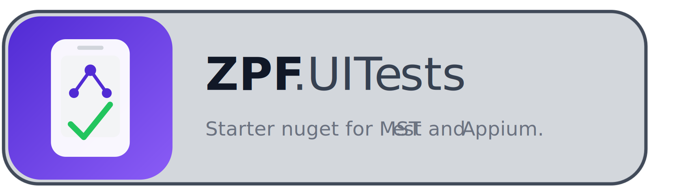

ZPF.UITests is a starter nuget for MSTest and Appium. It provides a simple and efficient way to set up and run UI tests for your applications. With ZPF.UITests, you can quickly create and execute tests that interact with your application's user interface, ensuring that your app works as expected across different devices and platforms.

# !!! doc under construction !!!

---   

 &nbsp;
 &nbsp;
 &nbsp;
 

| Platform  | Android | iOS  |  Mac  |  Linux  | Windows |
| :-------- | :-----: | :--: | :---: | :-----: | :-----: |
| Host      |   ❌    |  ❌  |  🚧  |   ✅    |   ✅   |
| Tested    |   ✅    |  🚧  |  🚧  |   ✅    |   ✅   |

✅ tested and working  
🚧 in progress, could be working but not tested yet  
❌ not possible  

---

# Features
 * Helper for screenshots + page source captured
 * Generates Screenshots & Page source on failure
 * ...

---

# Project Structure

## Maui Application
Maui is a simple sample app from Maui's standard templates. It includes basic UI elements such as buttons, labels, and entry fields that can be interacted with during testing. The only thing that was added is the Button in the MainPage.xaml got an addition attribute: CounterBtn. This is the identifier used to locate the button in our UI tests.
&nbsp;

## MSTest_Appium
MSTest_Appium is a test project that contains UI tests for the Maui application. It uses MSTest as the testing framework and Appium for automating interactions with the Maui app.
&nbsp;

## ZPF.UITests
ZPF.UITests is a test framework project (the nuget) that provides common utilities and helper methods for UI testing. It includes functionality for starting the Appium server, capturing screenshots, and generating page source on test failures. This project is designed to be reusable across different test projects and can be extended with additional features as needed.
&nbsp;  
&nbsp;  
   
# Getting Started
Test execution is performed via Appium, which operates using a client–server architecture. The Appium server exposes a WebDriver-compatible API and orchestrates all automation commands against the client application running on the target device. As a result, an active Appium server instance is required for any test run.

In this example, the test framework includes logic to programmatically start the Appium server as part of the test lifecycle. However, Appium itself—along with all platform-specific dependencies—must still be installed and configured on the host machine where the tests will be executed.

