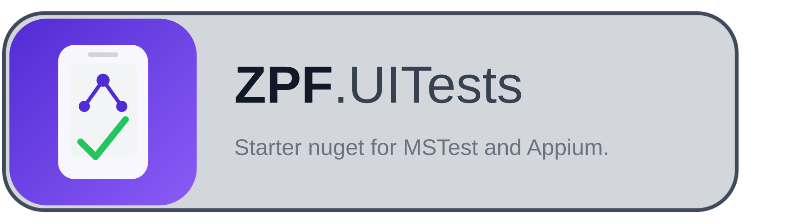

ZPF.UITests is a starter nuget for MSTest and Appium. It provides a simple and efficient way to set up and run UI tests for your applications. With ZPF.UITests, you can quickly create and execute tests that interact with your application's user interface, ensuring that your app works as expected across different devices and platforms.

# !!! under construction !!!

# ZPF.UITests

**A comprehensive NuGet package for MSTest and Appium that simplifies UI testing for .NET MAUI applications across multiple platforms.**

[](https://www.nuget.org/packages/ZPF.UITests)
[](https://www.nuget.org/packages/ZPF.UITests)
[](https://github.com/ZeProgFactory/ZPF.UITests/blob/main/LICENSE)
[](https://github.com/ZeProgFactory/ZPF.UITests/commits/main)
[](https://deepwiki.com/ZeProgFactory/ZPF.UITests)

---

## 📋 Table of Contents
- [Platform Support](#-platform-support-matrix)
- [Features](#-features)
- [Installation](#-installation)
- [Quick Start](#-quick-start)
- [Project Structure](#-project-structure)
- [Core Components](#-core-components)
- [Configuration](#-configuration-options)
- [Getting Started](#-getting-started)
- [Example Tests](#-example-tests)
- [Contributing](#-contributing)
- [License](#-license)

---

## 🎯 Platform Support Matrix

### Sample app tested on:
| Platform            | Android | iOS | Mac | Linux | Windows |
|:--------------------|:-------:|:---:|:---:|:-----:|:-------:|
| Native              | ✅      | ✅  | ✅  | 🚧    | ✅      |
| Emulator on Windows | ✅      | 🚧  | ❌  | ❌    | ❌      |
| Emulator on Mac     | ✅      | ✅  | ❌  | ❌    | ❌      |

### Appium server hosting and test execution on:
| Platform          | Android | iOS | Mac | Linux | Windows |
|:------------------|:-------:|:---:|:---:|:-----:|:-------:|
| Appium on Windows | ✅      | 🚧  | ❌  | ❌    | ✅      |
| Appium on Mac     | ✅      | ✅  | 🚧  | ❌    | ❌      |
| Appium on Linux   | ✅      | 🚧  | ❌  | 🚧    | ❌      |

**Legend:**  
✅ Tested and working  
🚧 In progress, could be working but not tested yet  
❌ Not possible

---

## ✨ Features

### 🚀 **Cross-Platform Support**
- **Android** - Native and emulator testing
- **iOS** - Native and simulator testing  
- **macOS** - Native application testing
- **Windows** - Desktop application testing
- **Linux** - (In Progress)

### 🔧 **Automatic Appium Management**
- Auto-start Appium server if not running
- Port availability detection
- Automatic server health checks
- Relaxed security mode support

### 📸 **Smart Screenshot Capture**
- Automatic screenshots on test failure
- Optional screenshots on test completion
- Before/After comparison with diff generation
- Timestamp-based file naming
- Automatic attachment to test results

### 📄 **Page Source Capture**
- XML page source capture on failure
- Optional page source capture on all tests
- Integrated with test results for debugging

### 🎯 **Easy Element Location**
- Extension methods for finding UI elements
- Cross-platform element locator abstractions
- Support for AccessibilityId and Id selectors
- Text-based element filtering

### ⚙️ **Flexible Configuration**
- `UITestConfig` for centralized test settings
- Customizable test results folder
- Per-platform device and app configuration
- Session grouping with multiple naming strategies

### 🧪 **Test Base Classes**
- Ready-to-use base classes for each platform
- `TestBase` with automatic cleanup
- Built-in TestContext integration
- Driver lifecycle management

### 🏭 **Platform-Specific Driver Factories**
- `DriverFactory` for creating platform-specific drivers
- Android emulator detection and management
- iOS simulator support
- Automatic app installation and cleanup

### 📊 **Image Comparison**
- Before/After screenshot comparison
- Difference image generation
- Configurable threshold for image matching
- Visual regression testing support

### 🗂️ **Test Organization**
- Multiple folder naming strategies (PrevCurrent, TimeStamp)
- Session-based test grouping
- Automatic test result file management

---

## 📦 Installation
Install the NuGet package in your MSTest project:

```
dotnet add package ZPF.UITests
```

Or via Package Manager Console:
```
Install-Package ZPF.UITests
```


---

## 🚀 Quick Start

### 1. Create a Test Class
```
using ZPF.UITests;

[TestClass] 
public class MyAppTests : TestBase 
{ 
   [TestInitialize]
   public void Setup() 
   { 
      // Configure your app settings 
      UITestViewModel.Current.Config.PackageID = "com.mycompany.myapp"; 
      UITestViewModel.Current.Config.APK = @"path/to/your/app.apk"; 
      UITestViewModel.Current.TestContext = TestContext;

      // Create the driver for your platform
      Driver = DriverFactory.CreateAndroidDriver();
   }

   [TestMethod]
   public void TestButtonClick()
   {
       // Find and interact with UI elements
       var button = Driver.FindUIElement("CounterBtn");
       button.Click();
    
       // Add your assertions
       Assert.IsNotNull(button);
   }
}
```

### 2. Configure Your Tests
```
var config = new UITestConfig 
{ 
   PackageID = "com.companyname.myapp", 
   APK = @"D:\Apps\MyApp.apk", 
   AndroidDeviceName = "pixel_7_-_api_36_0", 
   ScreenshotOnExit = true, 
   CompareBeforeAfter = false, 
   TestResults = @"D:\TestResults" 
};
UITestViewModel.Current.Config = config;
```

### 3. Run Your Tests
Execute your tests using Visual Studio Test Explorer or the command line:
```
dotnet test
```

---

## 🏗️ Project Structure

This repository contains three main components:

### **Maui Application**
A simple sample app based on the standard .NET MAUI template. It includes basic UI elements such as buttons, labels, and entry fields that can be interacted with during testing. 

**Key Modification:** The Button in `MainPage.xaml` has an additional attribute `CounterBtn`, which serves as the identifier used to locate the button in UI tests.

### **MSTest_Appium**
A test project containing UI tests for the MAUI application. It uses:
- **MSTest** as the testing framework
- **Appium** for automating interactions with the MAUI app
- Demonstrates practical test implementations across different platforms

### **ZPF.UITests**
The test framework project (the NuGet package) that provides common utilities and helper methods for UI testing. Key functionality includes:
- Starting the Appium server automatically
- Capturing screenshots and page sources
- Generating test artifacts on failures
- Platform-specific driver factories
- Reusable test base classes

This project is designed to be reusable across different test projects and can be extended with additional features as needed.

---

## 📚 Core Components

### **UITestConfig**
Centralized configuration for all test settings:

```
public class UITestConfig 
{ 
   // Test Results Management 
   public string TestResults { get; set; } 
   public bool GroupSessionInFolder { get; set; } 
   public FolderNamingStrategies FolderNamingStrategy { get; set; }

   // Screenshot & Capture Options
   public bool ScreenshotOnExit { get; set; }
   public bool CompareBeforeAfter { get; set; }
   public bool CapturePageSource { get; set; }

   // App Configuration
   public string PackageID { get; set; }

   // Appium Server
   public string DriverUrl { get; set; }
   public string host { get; set; }
   public int port { get; set; }

   // Platform-Specific Settings
   public string APP_WIN { get; set; }
   public string APK { get; set; }
   public string AndroidDeviceName { get; set; }
   public string APP_iOS { get; set; }
   public string iOSDeviceName { get; set; }
   public string APP_OSX { get; set; }
   public string BundleID_OSX { get; set; }
}
```

### **DriverFactory**
Factory class for creating platform-specific Appium drivers:
```
// Create drivers for different platforms 

var androidDriver = DriverFactory.CreateAndroidDriver(); 
var iosDriver = DriverFactory.CreateIOSDriver(); 
var macDriver = DriverFactory.CreateMacDriver(); 
var windowsDriver = DriverFactory.CreateWindowsDriver();
```

Features:
- Automatic Appium server startup
- Platform detection
- Emulator management
- App installation and cleanup

### **TestBase**
Base class providing automatic test lifecycle management:

```
[TestClass] 
public class TestBase 
{ 
   public TestContext TestContext { get; set; } 
   public AppiumDriver Driver { get; set; }

   [TestCleanup]
   public void Cleanup()
   {
       // Automatic cleanup:
       // - Captures screenshots on failure
       // - Saves page source
       // - Performs before/after comparisons
       // - Disposes driver
   }
}
```

### **AppiumExtensions**
Helper extension methods for easier element interaction:
```
// Find element by ID var button = Driver.FindUIElement("CounterBtn");
// Find element by ID and text var specificButton = Driver.FindUIElement("ButtonId", "Click Me");
```

### **ScreenshotHelper**
Screenshot and page source utilities:
```
// Capture screenshot ScreenshotHelper.Capture(driver, testName, testContext);
// Capture page source ScreenshotHelper.CapturePageSource(driver, testName, testContext);
```

---

## 🔧 Configuration Options

| Property | Description | Default |
|----------|-------------|---------|
| `TestResults` | Path for test results | `TestContext.DeploymentDirectory` |
| `GroupSessionInFolder` | Group tests in session folders | `true` |
| `FolderNamingStrategy` | Folder naming strategy | `PrevCurrent` |
| `ScreenshotOnExit` | Capture screenshot on test completion | `true` |
| `CompareBeforeAfter` | Enable before/after comparison | `false` |
| `CapturePageSource` | Always capture page source | `false` |
| `PackageID` | App package identifier | Required |
| `DriverUrl` | Appium server URL | `http://127.0.0.1:4723` |
| `host` | Appium server host | `127.0.0.1` |
| `port` | Appium server port | `4723` |
| `APP_WIN` | Windows app path | - |
| `APK` | Android APK path | - |
| `AndroidDeviceName` | Android device/emulator name | `pixel_7_-_api_36_0` |
| `APP_iOS` | iOS app path | - |
| `iOSDeviceName` | iOS device/simulator name | `iPhone 15 Pro` |
| `APP_OSX` | macOS app path | - |
| `BundleID_OSX` | macOS bundle ID | - |

---

## 🚀 Getting Started

### Prerequisites

Test execution is performed via **Appium**, which operates using a **client-server architecture**. The Appium server exposes a WebDriver-compatible API and orchestrates all automation commands against the client application running on the target device. As a result, an active Appium server instance is required for any test run.

In this example, the test framework includes logic to programmatically start the Appium server as part of the test lifecycle. However, Appium itself—along with all platform-specific dependencies—must still be installed and configured on the host machine where the tests will be executed.

#### What You Need:
1. **Appium Server** - Must be installed and accessible
2. **Platform-specific dependencies**:
   - **Android**: Android SDK, ADB, Java JDK
   - **iOS**: Xcode, iOS Simulator
   - **macOS**: Xcode
   - **Windows**: WinAppDriver (for native Windows apps)

### Installation Steps

#### 1. Install Appium
```
npm install -g appium
```

#### 2. Install Platform Drivers

Android
```
appium driver install uiautomator2
```

iOS
```
appium driver install xcuitest
```

Mac
```
appium driver install mac2
```

Windows
```
appium driver install windows
```


#### 3. Verify Installation
```
appium -v
```

#### 4. Install ZPF.UITests NuGet
```
dotnet add package ZPF.UITests
```

### Example Test Project Setup

1. Create a new MSTest project
2. Install ZPF.UITests NuGet package
3. Add your app binary (APK, IPA, EXE, APP)
4. Configure `UITestConfig` with your app details
5. Create test classes inheriting from `TestBase`
6. Write your tests using Appium commands
7. Run tests from Visual Studio Test Explorer or CLI

---

## 📖 Example Tests

### Android Test
```
[TestClass] 
public class AndroidTests : TestBase 
{ 
   [TestInitialize] 
   public void Setup() 
   { 
      UITestViewModel.Current.Config = new UITestConfig 
      { 
         PackageID = "com.companyname.maui", 
         APK = @"D:\Apps\Maui.apk", 
         AndroidDeviceName = "pixel_7_-_api_36_0", 
         TestResults = @"D:\TestResults" 
      }; 
      
      UITestViewModel.Current.TestContext = TestContext;
      Driver = DriverFactory.CreateAndroidDriver();
   }

   [TestMethod]
   public void TestCounterIncrement()
   {
      var button = Driver.FindUIElement("CounterBtn");
      var initialText = button.Text;
    
      button.Click();
      Thread.Sleep(500);
    
      var newText = button.Text;
      Assert.AreNotEqual(initialText, newText);
   }
}
```


### Windows Test
```
[TestClass] 
public class WindowsTests : TestBase 
{ 
   [TestInitialize] 
   public void Setup() 
   { 
      UITestViewModel.Current.Config = new UITestConfig 
      { 
         APP_WIN = @"D:\Apps\Maui.exe", 
         TestResults = @"D:\TestResults" 
      }; 
      UITestViewModel.Current.TestContext = TestContext;
      Driver = DriverFactory.CreateWindowsDriver();
   }

   [TestMethod]
   public void TestWindowsApp()
   {
       var button = Driver.FindUIElement("CounterBtn");
       button.Click();
    
       Assert.IsNotNull(button);
   }
}
```

### iOS Test
```
[TestClass] 
public class iOSTests : TestBase 
{ 
   [TestInitialize] 
   public void Setup() 
   { 
      UITestViewModel.Current.Config = new UITestConfig 
      { 
         PackageID = "com.companyname.maui", 
         APP_iOS = @"/path/to/Maui.app", 
         iOSDeviceName = "iPhone 15 Pro", 
         TestResults = @"D:\TestResults" 
       }; 
    
       UITestViewModel.Current.TestContext = TestContext;
       Driver = DriverFactory.CreateIOSDriver();
   }

   [TestMethod]
   public void TestiOSApp()
   {
       var button = Driver.FindUIElement("CounterBtn");
       button.Click();
    
       Assert.IsNotNull(button);
   }
}
```


### macOS Test
```
[TestClass] 
public class MacTests : TestBase 
{ 

   [TestInitialize] public void Setup() 
   { 
      UITestViewModel.Current.Config = new UITestConfig { BundleID_OSX = "com.companyname.maui", APP_OSX = @"/Applications/Maui.app", TestResults = @"/Users/username/TestResults/" }; 
      UITestViewModel.Current.TestContext = TestContext;
      Driver = DriverFactory.CreateMacDriver();
   }

   [TestMethod]
   public void TestMacApp()
   {
       var button = Driver.FindUIElement("CounterBtn");
       button.Click();
    
       Assert.IsNotNull(button);
   }
}
```

---

## 🤝 Contributing

Contributions are welcome! Please feel free to submit a Pull Request. For major changes, please open an issue first to discuss what you would like to change.

### How to Contribute
1. Fork the repository
2. Create your feature branch (`git checkout -b feature/AmazingFeature`)
3. Commit your changes (`git commit -m 'Add some AmazingFeature'`)
4. Push to the branch (`git push origin feature/AmazingFeature`)
5. Open a Pull Request

---

## 📄 License

This project is licensed under the MIT License - see the [LICENSE](LICENSE) file for details.

---

## 🙏 Acknowledgments

- Built on top of [Appium](http://appium.io/)
- Uses [Selenium WebDriver](https://www.selenium.dev/)
- Powered by [MSTest](https://docs.microsoft.com/en-us/dotnet/core/testing/unit-testing-with-mstest)
- Image comparison powered by ZPF.Skia

---

## 📞 Support

- **Issues**: [GitHub Issues](https://github.com/ZeProgFactory/ZPF.UITests/issues)
- **Discussions**: [GitHub Discussions](https://github.com/ZeProgFactory/ZPF.UITests/discussions)
- **Documentation**: [Wiki](https://github.com/ZeProgFactory/ZPF.UITests/wiki)

---

## 🔗 Related Resources

- [Appium Documentation](http://appium.io/docs/en/latest/)
- [.NET MAUI Documentation](https://docs.microsoft.com/en-us/dotnet/maui/)
- [MSTest Documentation](https://docs.microsoft.com/en-us/dotnet/core/testing/unit-testing-with-mstest)
- [Selenium WebDriver Documentation](https://www.selenium.dev/documentation/webdriver/)

---

Made with ❤️ by [ZeProgFactory](https://github.com/ZeProgFactory)